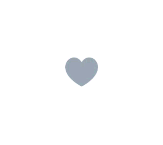

# FaveButton
[Fave Button](https://github.com/xhamr/fave-button)

炫酷的button，是swift写的，然后就转成Objective-C。



## 原理

### FaveButton
FaveButton继承于UIButton，在设置image的时候，我们通过初始化将image传递给FaveIcon，然后把自身的image设置成nil

FaveButton由3部分组成：FaveIcon，Ring，Spark。

FaveButton实际上是将3个部分组合在一起，做一些动画上的处理。

### FaveIcon
继承于UIView

一个提供了添加image的显示，内部使用layer实现，然后提供scale动画。

内部包含iconLayer与iconMask，在初始化时将宽高都设置为0，因此，该类只是一个载体，方便layer做一些事情，本身不做任何事情。

初始化iconLayer，并设置大小与superView一致，因为faveIcon在superView的中心且宽高为0，所以需要设置origin往上偏移。

iconMask是iconLayer的mask，将图片给iconMask

```
self.iconMask =
    ({
        CALayer *layer = [CALayer layer];
        
        layer.contents = (__bridge id)(self.iconImage.CGImage);
        layer.contentsScale = [UIScreen mainScreen].scale;
        layer.bounds = maskRegion;
        
        layer;
    });
```
#### animation
提供动画API，以方便调用，主要是颜色的变化以及大小。

### Ring
一个提供圆形动画的view

ring内有一个centerView，centerView内有一个ringLayer。

形成的效果就是内部圆慢慢变大，使用的方法是控制scale以及lineWidth。
### Spark
一个提供2个小圆动画的view，动画时四周的每2个小圆即是一个saprk。

拥有2个dotView，分别对应小圆。


# END
动画组合起来真的是很beautiful！！